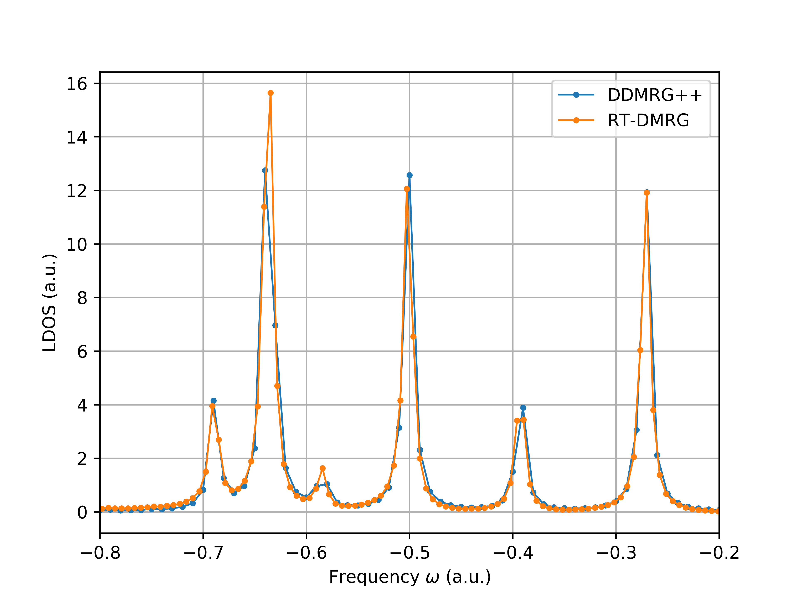

Real-Time Time-Dependent DMRG (RT-TD-DMRG)
==========================================

References:

* Ronca, E., Li, Z., Jimenez-Hoyos, C. A., Chan, G. K. L. Time-step targeting time-dependent and dynamical density matrix renormalization group algorithms with ab initio Hamiltonians. *Journal of Chemical Theory and Computation* 2017, **13**, 5560-5571.

Here we use RT-TD-DMRG and Fast Fourier Transform (FFT) to calculate the same quantity
defined in previous section, namely,
the Green's function for H10 (STO6G) (for a wide range of frequencies):

.. math::

    G_{ij}(\omega) = \langle \Psi_0 | a_j^\dagger \frac{1}{\omega + \hat{H}_0 - E_0 + i \eta} a_i |\Psi_0\rangle

where :math:`|\Psi_0\rangle` is the ground-state, :math:`i = j = 4` (``isite``), :math:`\eta = 0.05`.

This is obtained from a Fourier transform from time domain to frequency domain:

.. math::

    G_{ij}(t) =&\ - i \langle \Psi_0 | a_j^\dagger \mathrm{e}^{-i (\hat{H}_0 - E_0 ) t} a_i |\Psi_0\rangle \\
    G_{ij}(\omega) =&\ \int_{-\infty}^{\infty} \mathrm{d} t \mathrm{e}^{-i \omega t} G_{ij}(t) \mathrm{e}^{- \eta t}

where :math:`\mathrm{e}^{- \eta t}` is a broading factor.

.. code:: python

    import time
    import numpy as np
    from pyblock3.algebra.mpe import MPE
    from pyblock3.hamiltonian import Hamiltonian
    from pyblock3.algorithms.core import DecompositionTypes
    from pyblock3.fcidump import FCIDUMP
    from pyblock3.symbolic.expr import OpElement, OpNames
    from pyblock3.algebra.symmetry import SZ

    np.random.seed(1000)

First, we load the definition of a quantum chemistry Hamiltonian from a FCIDUMP file.
Use ``flat = True`` to activate the efficient C++ backend.

.. code:: python

    fd = '../data/H10.STO6G.R1.8.FCIDUMP'
    ket_bond_dim = 500
    bra_bond_dim = 500

    hamil = Hamiltonian(FCIDUMP(pg='d2h').read(fd), flat=True)

Then, we build the MPO ``mpo`` for the Hamiltonian. The compression of ``mpo`` can decrease
the MPO bond dimension, which will then save some runtime during DMRG and time evolution algorithms.

.. code:: python

    tx = time.perf_counter()
    mpo = hamil.build_qc_mpo()
    print('MPO (NC) =         ', mpo.show_bond_dims())
    print('build mpo time = ', time.perf_counter() - tx)

    tx = time.perf_counter()
    mpo, _ = mpo.compress(left=True, cutoff=1E-9, norm_cutoff=1E-9)
    print('MPO (compressed) = ', mpo.show_bond_dims())
    print('compress mpo time = ', time.perf_counter() - tx)

Now we build a random MPS, as the initial guess for the DMRG algorithm.

.. code:: python

    mps = hamil.build_mps(ket_bond_dim)
    print('MPS = ', mps.show_bond_dims())

``MPE`` (Matrix Product Expectation) is a bra-mpo-ket tensor network structure,
with some partial contraction of envionments stored internally.
DMRG (sweep) algorithm can be invoked based on ``MPE``.
For DMRG algorithm, bra and ket are the same, both represented as the ``mps`` object.

.. code:: python

    bdims = [500]
    noises = [1E-4, 1E-5, 1E-6, 0]
    davthrds = None

    dmrg = MPE(mps, mpo, mps).dmrg(bdims=bdims, noises=noises,
                                dav_thrds=davthrds, iprint=2, n_sweeps=20, tol=1E-12)
    ener = dmrg.energies[-1]
    print("Energy = %20.12f" % ener)

Now ``ener`` is the ground-state energy :math:`E_0` of the system. We substract
this constant from MPO to let the ``mpo`` object represent :math:`\hat{H}_0 - E_0`.

.. code:: python

    isite = 4
    mpo.const -= ener

Here, ``dop`` is the destruction operator :math:`\hat{a}_{4\alpha}`, defined using ``OpElement``,
where the first argument ``OpNames.D`` is the operator name,
the second argument ``(isite, 0)`` is the orbital index (counting from zero) and spin index (0 = alpha, 1 = beta),
and the last argument ``q_label`` is a quantum number, representing how this operator changes
the quantum number of a state. Here :math:`\hat{a}_{4\alpha}` will decrease particle number by 1,
decrease ``2S_z`` by 1, and change point group irrep by the point group irrep of orbital ``isite`` (which is 4 here).
An MPO ``dmpo`` (bond dimension = 1) can be directly built from single site operator ``dop`` using
:func:`hamil.build_site_mpo`.

.. code:: python

    dop = OpElement(OpNames.D, (isite, 0), q_label=SZ(-1, -1, hamil.orb_sym[isite]))
    dmpo = hamil.build_site_mpo(dop)
    print('DMPO =         ', dmpo.show_bond_dims())

Next, we need to construct an MPS ``bra``, which is :math:`\hat{a}_{4\alpha} |\Psi_0\rangle` where
:math:`|\Psi_0\rangle` is the ground-state ``mps``.
First we define ``bra`` as a random MPS with the correct quantum number.
The quantum number of ``bra`` is simply the sum of the quantum number of ``dop`` and ``mps``.

.. code:: python

    bra = hamil.build_mps(bra_bond_dim, target=SZ.to_flat(
        dop.q_label + SZ.from_flat(hamil.target)))

Then we use :func:`MPE.linear` to fit ``bra`` to ``dmpo @ mps``.
This is a sweep algorithm similar to DMRG.
In principle, the following line (and the above line) can be replaced by simply
``bra = dmpo @ mps; bra.fix_pattern()`` (which may be slower).
Also note that ``MPE.linear`` may have some problems handling the constant term in MPO.
If the mpo has a constant term (the ``dmpo`` here does not have a constant), one can do
``MPE(bra, mpo - mpo.const, mps).linear(...); bra += mpo.const * mps``.

.. code:: python

    MPE(bra, dmpo, mps).linear(bdims=[bra_bond_dim], noises=noises,
                                    cg_thrds=davthrds, iprint=2, n_sweeps=20, tol=1E-12)

Now we obtain a (deep) copy of ``bra`` to be ``ket``. Later when we time evolve ``ket``,
``bra`` will not be changed.

.. code:: python

    ket = bra.copy()
    dt = 0.1
    eta = 0.05
    t = 100.0

    nstep = int(t / dt)

Real time evolution can be performed using :func:`MPE.tddmrg`, with a imaginary ``dt`` argument.
``normalize`` should be set to ``False``, so that we will not keep ``ket`` normalized,
so that the constant prefactor in ``ket`` will transformed into ``rtgf``, which is convenient.
Note that since (in principle) real time evolution does not change the norm of the MPS,
whether keeping the MPS normalized should not make a difference.
When MPS is not explicitly normalized, the norm of MPS printed after each sweep can be
used as an indicator of the accuracy of the algorithm.
For imaginary time evolution, however, it is recommended to explicitly normalize MPS,
since during the imaginary time evolution the prefactor in the MPS is not a constant.
It can grow up rapidly, which may create some numerical problem.

After each time step, the overlap between ``bra`` and ``ket``, which is :math:`G_{44}(t)`, is calculated
and stored in ``rtgf``.

.. code:: python

    mpe = MPE(ket, mpo, ket)
    rtgf = np.zeros((nstep, ), dtype=complex)
    print('total step = ', nstep)
    for it in range(0, nstep):
        cur_t = it * dt
        mpe.tddmrg(bdims=[500], dt=-dt * 1j, iprint=2, n_sweeps=1, n_sub_sweeps=2, normalize=False)
        rtgf[it] = np.dot(bra.conj(), ket)
        print("=== T = %10.5f EX = %20.15f + %20.15f i" % (cur_t, rtgf[it].real, rtgf[it].imag))

A single step of time evolution can also be written as (currently not completely supported),
which can be significantly slower than :func:`MPE.tddmrg`.

.. code:: python

    # fmps = rk4_apply((-dt * 1j) * mpo, mps)

Finally, one can use FFT to transform back to frequency domain.

.. code:: python

    def gf_fft(eta, dt, rtgf):

        dt = abs(dt)
        npts = len(rtgf)

        frq = np.fft.fftfreq(npts, dt)
        frq = np.fft.fftshift(frq) * 2.0 * np.pi
        fftinp = -1j * rtgf * np.exp(-eta * dt * np.arange(0, npts))

        Y = np.fft.fft(fftinp)
        Y = np.fft.fftshift(Y)

        Y_real = Y.real * dt
        Y_imag = Y.imag * dt

        return frq, Y_real, Y_imag

    frq, yreal, yimag = gf_fft(eta, dt, rtgf)

The following figure compares the results obtained from DDMRG++ and td-DMRG (with
lowdin orbitals, dt = 0.1, eta = 0.005, t = 1000.0).

